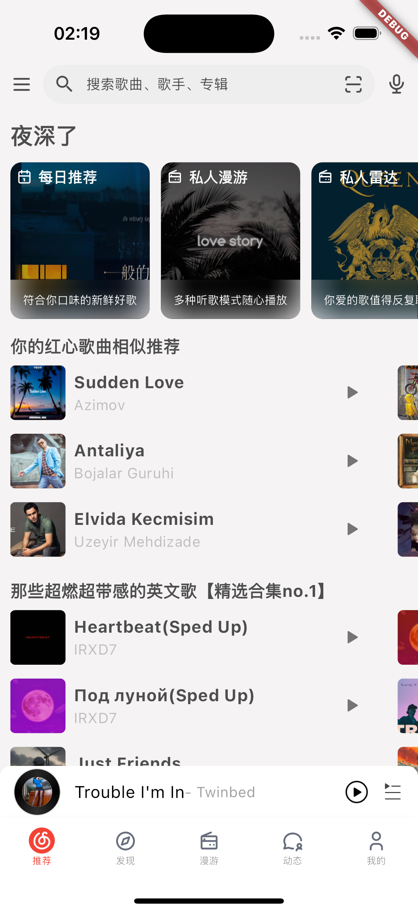
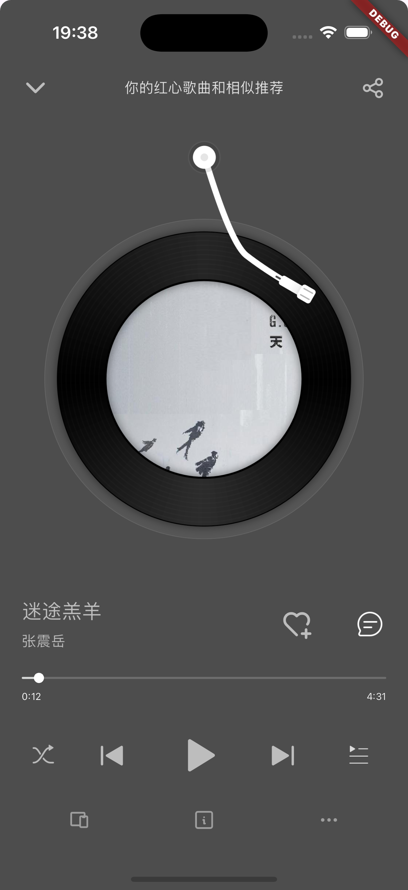

# 仿网易云音乐项目

## 项目运行

此项目还在不断完善中，目前离v1版本还有一定距离，欢迎大家提出宝贵意见。

1. 启动后端服务，端口默认3000
    - git clone https://gitlab.com/Binaryify/neteasecloudmusicapi.git
    - npm i
    - node app.js
2. 启动该项目，目前只支持短信验证码登录

## 展示

  

## 项目介绍

flutter版本网易云音乐

- 仿照网易云音乐版本 9.1.55

- flutter开发版本: 3.24.1

- 后端接口：https://github.com/Binaryify/NeteaseCloudMusicApi

- 参考项目：
    - https://github.com/2697a/bujuan autoroute
    - https://gitee.com/master_xing/flutter_cloud_music 底部粘性播放条实现

- 技术栈：getx, getit, gorouter/autoRouter

## 页面预览

- 推荐页面 main - 已完成
- 发现页面 found - 已完成
- 漫游页面 roam - 已完成
- 动态页面 timeline - 已完成
- 我的页面 user - 已完成
- 搜索页面 search - 已完成
- 歌单页面 songlist - 已完成
- mv页面 mv - 未开始
- 评论页面 comment - 未开始
- 消息页面 message - 未开始

## 项目规划

### p1

- 页面基本复制网易云音乐app页面 - 已完成
- 音乐播放&后台播放 - 已完成
- 评论页面 - 已完成(页面很糙)
- 歌词页面 - 已完成(页面很糙)
- 漫游功能重构 - 未开始
- 页面样式优化&代码优化 - 未开始
- 网络库优化 - 未开始
- android适配 - 未开始

### p2

- 视频播放 - 未开始
- 发布动态页面 - 未开始
- 骨架屏引入 - 未开始
- ios小组件开发 - 未开始
- 缓存策略 - 未开始

## Star History

